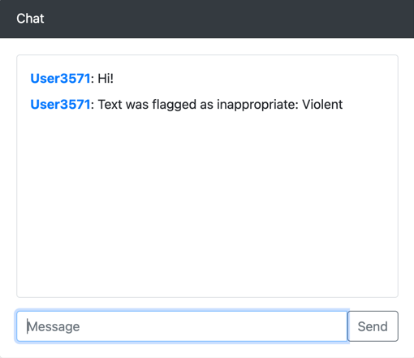

# IVS Chat Moderator

A CDK example of using a message review handler to call an external service to classify an IVS chat message for moderation.

## Review Handler Lambda

The example lambda calls ChatGPT 3.5 to classify the chat message as:

- Sexual
- Violent
- Hate Speech
- Neutral

If it is neutral, it allows the message to pass through unhindered. If not, it replaces the message text with the reason
for denying it.

## Chat Website

The CDK stack also includes a web UI to demo the functionality. Instructions on how to use it are displayed on the page.



## Usage

### Prerequisites

- AWS CDK
- Go

### Secrets

Upload your ChatGPT API key to [AWS Secrets Manager](https://us-west-2.console.aws.amazon.com/secretsmanager), using the name `gptApiKey`.

### Deployment

Execute the `make deploy` command to build the Go lambda and deploy the CDK stack. After deployment, CDK will
output the URL which you can use to access the Web UI, as well as the IVS Chat Room ID.

Examples:

```shell
IVSChatModeratorStackChatStack123.ChatRoomArn = arn:aws:ivschat:us-west-2:265828761234:room/zHloS5ghabcd
IVSChatModeratorStackWebsiteStack123.BucketURL = http://ivschatmoderatorstackwebsit-websitebucket75c24d94-123123213.s3-website-us-west-2.amazonaws.com
```
